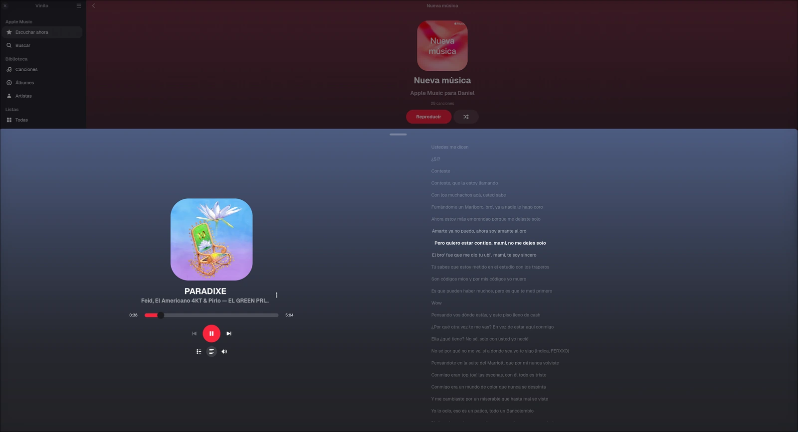
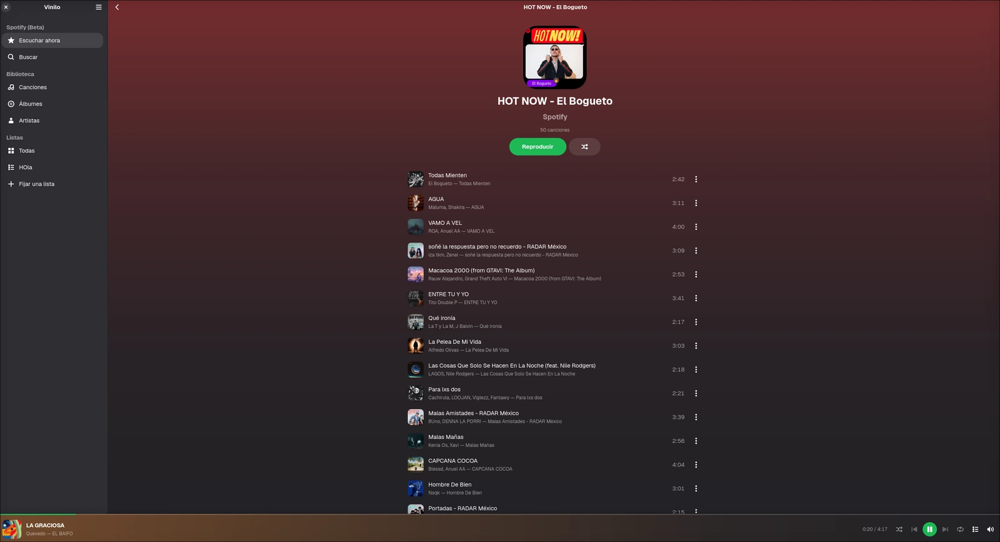
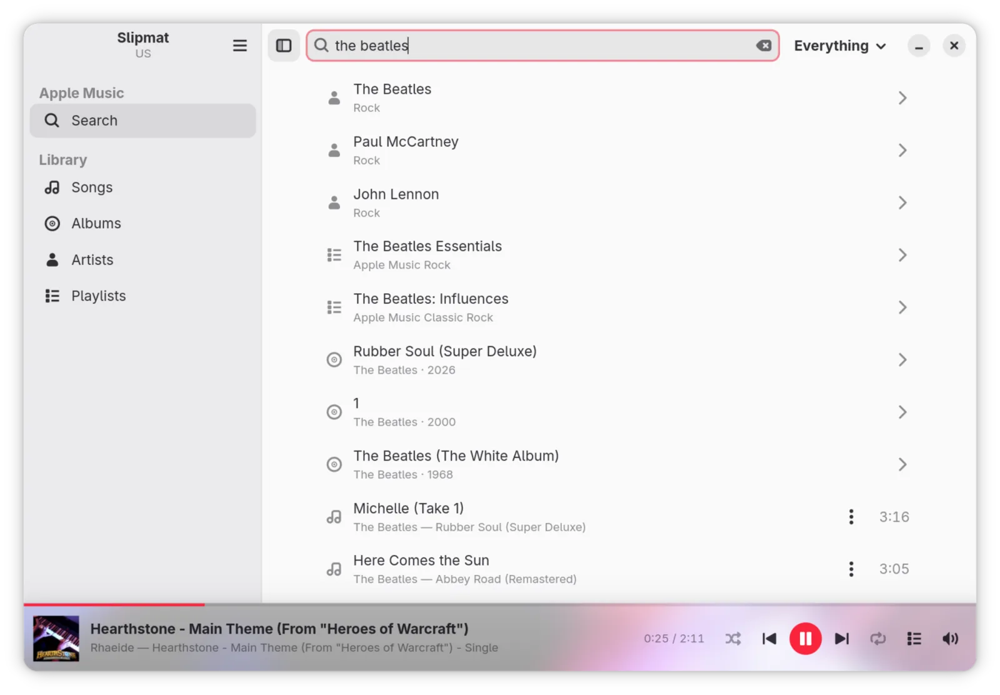
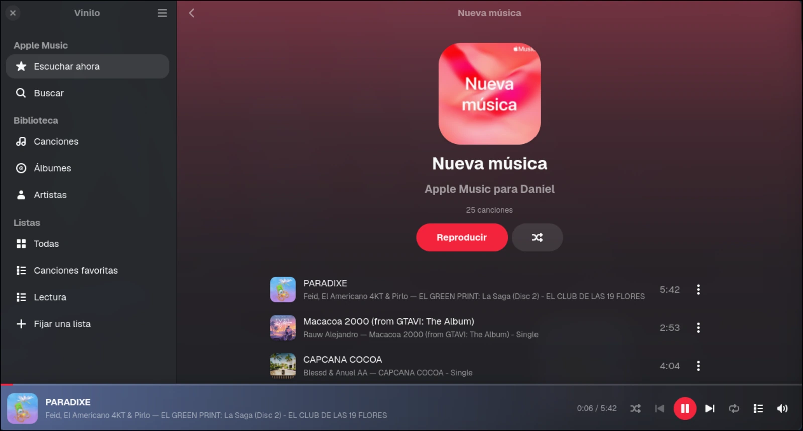

<!--
SPDX-FileCopyrightText: 2026 Daniel Miguel Tejedor
SPDX-FileCopyrightText: 2026 Miguel Rincon
SPDX-License-Identifier: GPL-3.0-or-later
-->

<div align="center">
  
  <h1>Vinilo</h1>
  <p><strong>A native GNOME music player for Linux.</strong></p>

  <p>
    
    
    
    
    
    <a href="./COPYING"></a>
  </p>

  <p>
    <a href="#installation">Installation</a> ·
    <a href="#sources">Sources</a> ·
    <a href="#preview">Preview</a> ·
    <a href="#why-vinilo">Why Vinilo</a> ·
    <a href="#first-launch">First launch</a> ·
    <a href="#support-and-contributions">Support</a>
  </p>
</div>

---

Vinilo is a native front-end for the music you already pay for, not a website
wrapped in a window. The interface is GTK4 and libadwaita. Apple Music still
needs Apple's own player and Google's official Widevine CDM, so a small
Chromium process stays hidden after sign-in. Local files never touch it.

A GNOME app and a terminal client (`aguja`) talk to the same engine. Closing
the window does not stop the music.

> [!IMPORTANT]
> **Apple Music** needs an active subscription, an **x86_64** machine and a
> network connection on every play. Linux Widevine cannot keep licences
> offline, so there is no download button and there never will be.

> [!TIP]
> **This computer** plays MP3, FLAC, Ogg and WAV on its own. No Chromium, no
> account, no sidecar. Choose that source on first launch if you only want
> files.

## Preview

<p align="center">
  
  
</p>

<p align="center">
  
  
  
</p>

## Why Vinilo

| Interface | Playback | Desktop |
| --- | --- | --- |
| A GNOME app, not a website in a frame | A player worth the name: gapless, with artwork and a queue | Play, pause and skip from the top bar, lock screen or media keys |
| Your library: songs, albums, artists and playlists | The catalogues you already use, searchable from one place | Music keeps going when you close the window |
| English or Spanish, chosen on first launch | A terminal client (`aguja`) on the same engine | Quick, and out of the way |

Vinilo is built for daily listening: one queue, two faces, and a small hidden
web layer only where DRM requires it.

## Sources

| Source | Channel | What you need |
| --- | --- | --- |
| Apple Music | Beta | Active subscription, x86_64, network on every play |
| This computer | Stable | Audio files on disk |
| Spotify | Beta | Sign-in. Premium uses librespot; otherwise a fallback |
| YouTube Music | Beta | Sign-in |
| Tidal | Alpha | Sign-in |

Favourites, library saves and new playlists are available from the row menu
where the source allows it. Change language or source later in
**Preferences** (`Ctrl`+`,`).

## Installation

Build and install from a clone of this repository, **inside that directory**,
into `~/.local` (no `sudo`).

### Arch Linux — recommended

1. Install the build and runtime packages:

   ```bash
   sudo pacman -S --needed base-devel pkgconf rustup gtk4 libadwaita librsvg \
                           nodejs npm libpulse alsa-lib yt-dlp ffmpeg webkitgtk-6.0
   rustup default stable   # Vinilo needs Rust ≥ 1.93 (edition 2024)
   ```

2. Clone and install:

   ```bash
   git clone https://github.com/danielmigueltejedor/vinilo.git
   cd vinilo
   make install
   ```

3. Open **Vinilo** from the app grid, or run `vinilo`.

The first Apple Music install also fetches castLabs Electron (~200 MB) for the
Widevine CDM. Local-only use skips that once you never open Apple Music.

> [!TIP]
> On **fish**, GNOME's PATH often omits `~/.local/bin`. Add it once with
> `fish_add_path ~/.local/bin`.

### Updating

```bash
cd ~/vinilo
pkill vinilo; pkill vinilod
make update
```

`make update` discards a dirty local `Cargo.lock`, fast-forwards `main` and
reinstalls. If the grid still launches nothing, the desktop file must read
`Exec=/home/YOU/.local/bin/vinilo-desktop`. Log out once if an icon or launcher
looks stale.

### Default player for files

In Files: right-click a track → **Open With** → Vinilo → **Always**. Or:

```bash
xdg-mime default dev.danielmiguelt.Vinilo.desktop audio/mpeg
xdg-mime default dev.danielmiguelt.Vinilo.desktop audio/flac
xdg-mime default dev.danielmiguelt.Vinilo.desktop audio/ogg
```

### Development

```bash
cargo run                 # GNOME app
cargo run -p aguja        # terminal client
make sidecar-run          # hidden player, window visible (DRM isolation)
make check                # fmt + clippy + tests
```

`aguja` is installed with Vinilo. Apple Music still needs a graphical session
because Chromium needs a display server.

## First launch

1. Choose **English** or **Español**.
2. Choose a source: Apple Music, this computer, Spotify, YouTube Music or Tidal.
3. Streaming sources open a **sign-in window** you cannot skip. Sign out from
   the app menu to pick another source.
4. The Apple Music library is cached for the next start. Local files play as
   soon as you open them.

Language lives in `~/.config/vinilo/locale`. The source lives in
`~/.config/vinilo/provider`. Catalogue sessions stay in cookies next to that;
tokens are never written to disk.

## How it works

```
┌────────────────────────────┐   ┌────────────────────────────┐
│  Vinilo  GTK4 / libadwaita │   │  aguja  terminal           │
│  library · search · player │   │  the same engine, in text  │
└─────────────┬──────────────┘   └─────────────┬──────────────┘
              │         JSON on a Unix socket
              └──────────────┬─────────────────┘
┌─────────────────────────────▼─────────────────────────────────┐
│  vinilod — the engine                         no window      │
│  queue · desktop controls · artwork · local files · cache    │
└──────────────┬──────────────────────────────┬────────────────┘
               │ Apple Music                  │ files
┌──────────────▼──────────────┐    ┌──────────▼────────────────┐
│  sidecar  castLabs Electron │    │  rodio in the engine      │
│  MusicKit + Widevine CDM    │    │  MP3, FLAC, Ogg, WAV…     │
└─────────────────────────────┘    └───────────────────────────┘
```

Apple Music goes through Apple's MusicKit player and Google's official CDM.
Vinilo does not strip DRM, cache decrypted audio, or offer downloads.

## Limitations

| Constraint | Why |
| --- | --- |
| No offline Apple Music | Linux Widevine cannot persist licences |
| ~200 MB Chromium sidecar | Only if you use Apple Music |
| x86_64 only for Apple Music | Linux ARM Widevine is not a stable target |
| Spotify, YouTube Music and Apple Music are **Beta**; Tidal is **Alpha** | Catalogue clients are still settling |
| `aguja` needs a desktop session for Chromium sources | The decoder still needs a display server |

## Support and contributions

- Use [GitHub Issues](https://github.com/danielmigueltejedor/vinilo/issues) for
  reproducible bugs and focused feature requests.
- Include the Vinilo version (`0.25.4`), distribution, GTK/libadwaita versions
  and the source (Apple Music, local, Spotify, YouTube Music or Tidal).
- Never paste tokens, cookies or `settings.ini` into an issue.

## Credits

Vinilo is a fork of [Slipmat](https://github.com/SoftARV/Slipmat)
(GPL-3.0-or-later) by Miguel Rincon. Linux Apple Music playback through
castLabs Electron follows the path opened by Sidra and Cider.

## License

Vinilo is released under the [GPL-3.0-or-later](./COPYING).

<p align="center">
  Designed and maintained by Daniel Miguel Tejedor.
</p>
