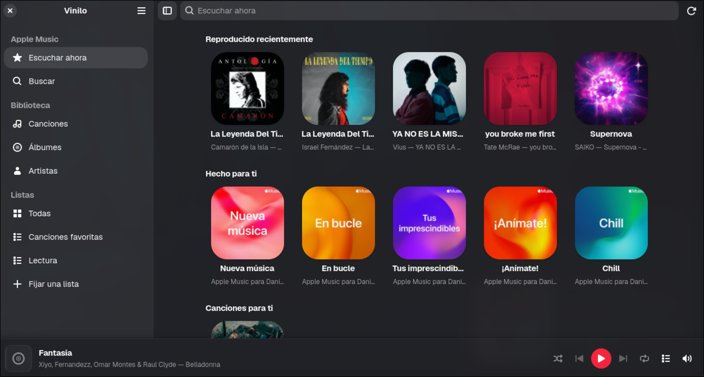

<!--
SPDX-FileCopyrightText: 2026 Daniel Miguel Tejedor
SPDX-FileCopyrightText: 2026 Miguel Rincon
SPDX-License-Identifier: GPL-3.0-or-later
-->

<p align="center">
  
</p>

# Vinilo

Reproductor nativo de Apple Music para Linux, con interfaz en **inglés** o **español**.

Vinilo es un fork de [Slipmat](https://github.com/SoftARV/Slipmat) de Miguel Rincon. Apple no publica cliente para Linux, y Widevine impide una pila de audio 100 % nativa. Vinilo dibuja su propia interfaz en Rust (GTK4 / libadwaita) y deja el motor web oculto solo para descifrar el audio.

La primera vez que abres la aplicación eliges idioma: **English** o **Español**. Luego puedes cambiarlo en **Preferencias** (`Ctrl`+`,`).

<p align="center">
  
</p>

## Qué hace

- **Dos clientes nativos.** La aplicación GNOME o `aguja` en la terminal. Ambos controlan el mismo motor.
- **Toda tu biblioteca.** Canciones, álbumes, artistas y listas. Reproducir una lista la convierte en la cola.
- **Reproducción sin cortes** y reproductor a pantalla completa con portada y cola.
- **Controles del escritorio.** Barra superior de GNOME, pantalla de bloqueo o teclas multimedia. La música sigue si cierras la ventana.
- **Búsqueda en Apple Music.** Artistas, álbumes, listas y canciones.
- **Idioma en Preferencias.** Inglés y español, elegidos al arrancar y cambiables después.

## Requisitos

Necesitas una **suscripción activa a Apple Music**, una máquina **x86_64** (Widevine en Linux solo existe ahí) y **red cada vez que reproduces**.

Cada instalación descarga una vez castLabs Electron (~200 MB de Chromium) para el CDM Widevine.

## Compilar e instalar

Necesitas Rust ≥ 1.93 (MSRV de relm4 0.11), GTK 4.20, libadwaita 1.8, Node y las dependencias de desarrollo:

```bash
sudo pacman -S --needed base-devel pkgconf rust gtk4 libadwaita librsvg \
                        nodejs npm libpulse
make install     # compila e instala en ~/.local, sin sudo
```

Arranca **Vinilo** desde la parrilla de aplicaciones o ejecuta `vinilo`. Si no encuentra el comando, añade `~/.local/bin` a tu `PATH`.

`aguja` se instala junto a Vinilo: el reproductor en terminal. También necesita una sesión gráfica porque el demonio ejecuta Chromium.

```bash
cargo run                                    # la app GNOME
cargo run -p aguja                           # el reproductor de terminal
RUST_LOG=vinilod=debug cargo run -p vinilod  # el motor
make sidecar-run                             # sidecar solo, ventana VISIBLE
make check                                   # fmt + clippy + test
```

## Primer arranque

1. Elige **English** o **Español**.
2. Inicia sesión en Apple Music. Se abre la página de Apple en una ventana aparte (incluido el 2FA). Después se oculta.
3. La biblioteca aparece desde la caché en los siguientes arranques.

El idioma queda en `~/.config/vinilo/locale` y en Preferencias.

## Cómo funciona

```
┌────────────────────────────┐   ┌────────────────────────────┐
│  Vinilo: GTK4/libadwaita   │   │  aguja: la terminal        │
│  biblioteca · búsqueda     │   │  lo mismo, en texto        │
└─────────────┬──────────────┘   └─────────────┬──────────────┘
              │      JSON por un socket Unix
              └──────────────┬─────────────────┘
┌────────────────────────────▼─────────────────────────────────┐
│  vinilod: el motor                            ← sin ventana  │
│  cola · MPRIS · portadas · caché de biblioteca               │
└────────────────────────────┬─────────────────────────────────┘
                             │
┌────────────────────────────▼─────────────────────────────────┐
│  sidecar: castLabs Electron                ← invisible       │
│  music.apple.com oculto  +  MusicKit  +  Widevine            │
└───────────────────────────────────────────────────────────────┘
```

Vinilo reproduce a través del reproductor MusicKit de Apple con el CDM oficial de Google. Es una interfaz nativa sobre una sesión con licencia. No quita el DRM ni descarga pistas.

## Limitaciones

- **Sin reproducción sin conexión.** El CDM de Linux no admite licencias persistentes.
- **~200 MB en disco** para el sidecar de Chromium.
- **Solo x86_64** mientras Widevine en Linux ARM no esté estable.
- **`aguja` necesita una sesión de escritorio.** Chromium pide un servidor de pantalla.

## Créditos

Fork de [Slipmat](https://github.com/SoftARV/Slipmat) (GPL-3.0-or-later) de Miguel Rincon. [Sidra](https://github.com/wimpysworld/sidra) y [Cider](https://cider.sh) abrieron el camino de castLabs Electron para Apple Music en Linux.

## Licencia

GPL-3.0-or-later. Ver [COPYING](COPYING).
